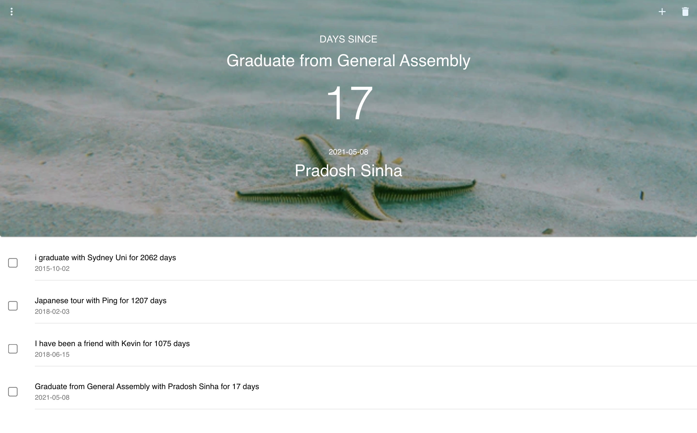

# rememberMe
> A full-stack application that traces back to the past and the people who spent that special moment with you

## Table of contents
* [General info](#general-info)
* [Demo](#demo)
* [Technologies](#technologies)
* [Prerequisite](#prerequisite)
* [Features](#features)
* [Status](#status)
* [Contact](#contact)

## General info
Inspired by the Mexican holiday Day of the Dead, I created a full-stack application that enables us to traces back to the past when we had the most unforgettable moment with someone and reminds ourselves of that precious time whenever we open the app.

## Demo

### live example
https://user-images.githubusercontent.com/75514149/119506108-f0fdf100-bdb0-11eb-8494-068eef341ada.mov

### Screenshots

## Technologies
* Tech 1 - React version 17.0.2
* Tech 2 - Ruby version 2.6.6
* Tech 3 - Rails version 6.1.3
* Tech 4 - JWT token
* Tech 5 - Postgresql
* Tech 6 - material-ui/moment.js

## Prerequisite 
* install react :
`$npx create-react-app my-app`
`$cd my-app`
`$npm start`
* install Ruby by Homebrew:
`$ brew install rbenv ruby-build`
* install rails on Mac:
`$sudo gem install rails`
* install Postgresql: https://www.postgresql.org/download/

## Features
List of features ready:
* Awesome feature 1: implement JWT to verify the authenticity 
* Awesome feature 2: bulk deleting events
* Awesome feature 3: responsive website with images refreshed automatically

To-do list:
* improvement to be done 1: customisable categories
* improvement to be done 2: notifications/alerts
* improvement to be done 3: import calendar events/contact birthday

## Status
Project is: _in progress_, I wish to continue optimising this site while writing my blogs 

## Contact
Created by [@Chelsie Fu](https://www.linkedin.com/in/chelsie-fu/) - feel free to contact me!
